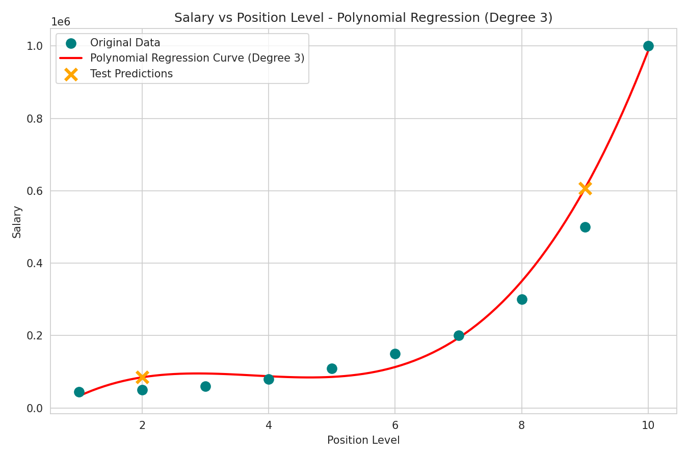

# Salary Prediction using Polynomial Regression

Name: SIYA SINGH
Registration Number: 23MIP10030
Application Number: IN26011506
Batch Number: 1A
Email: siya.23mip10030@vitbhopal.ac.in

## Objective
To build a Polynomial Regression model that predicts an employee's salary based on their position level, capturing the non-linear relationship between seniority and pay.

## Dataset
Position Salaries Dataset (Kaggle):
https://www.kaggle.com/datasets/akram24/position-salaries

The dataset is **not included** in this repository. Download it from the Kaggle link above and place it as `salary.csv` in the project root before running the notebook.

## Libraries Used
- pandas
- numpy
- matplotlib
- seaborn
- scikit-learn (`PolynomialFeatures`, `LinearRegression`, `train_test_split`, evaluation metrics)

## Methodology
1. **Data Understanding** — Loaded the dataset with Pandas, inspected the first five records, reviewed dataset info and summary statistics, and identified `Level` as the input feature and `Salary` as the target variable (`Position` was excluded since it duplicates `Level` as a text label).
2. **Data Preprocessing** — Checked for missing values (none found), selected `Level` as the feature and `Salary` as the target, and split the data into 80% training and 20% testing sets. Note: this dataset has only 10 rows total, so the test set is just 2 rows — small enough that evaluation metrics are illustrative rather than statistically robust.
3. **Model Development** — Transformed `Level` into degree-3 polynomial features and trained a `LinearRegression` model on the transformed features, then predicted salaries on the test set.
4. **Model Evaluation** — Evaluated the model with MAE, MSE, and R² Score, and visualized performance with a scatter plot of the original data plus the fitted polynomial regression curve.

## Results
| Metric | Value |
|---|---|
| MAE | 70,635.25 |
| MSE | 6,263,853,282.86 |
| R² Score | 0.8763 |

**Observations:**
1. The degree-3 polynomial curve tracks the sharp upward curve in salary at higher position levels much better than a straight line could — salary barely grows between levels 1-4, then rises steeply toward the CEO level.
2. With only 10 data points total, the 80/20 split leaves just 2 rows for testing, so the metrics above are more illustrative than statistically reliable.
3. The model fits the training range well but would extrapolate poorly beyond it — polynomial curves can swing sharply outside the range of the training data.

## Conclusion
This project used Polynomial Regression (degree 3) to predict employee salary from position level, since the relationship between the two is clearly non-linear — salary stays relatively flat across junior levels and then rises sharply at senior levels. The polynomial curve captured this pattern well within the range of the training data, closely following the steep salary jump at the higher position levels that a straight line would have completely missed.

The key difference between Linear and Polynomial Regression is the shape of the relationship each can model: Linear Regression fits a single straight line and assumes a constant rate of change between the input and target, while Polynomial Regression fits a curve by adding higher-degree terms of the input feature, allowing the rate of change to vary across the range of values. This makes Polynomial Regression far better suited to a dataset like this one, where salary growth accelerates non-linearly with seniority rather than increasing by a fixed amount at each level. The main advantage of Polynomial Regression here is that it lets a fundamentally curved relationship be modeled using ordinary linear regression machinery, simply by transforming the input feature — with the caveat that, given how small this dataset is, the model should not be trusted to extrapolate confidently beyond the observed position levels.
